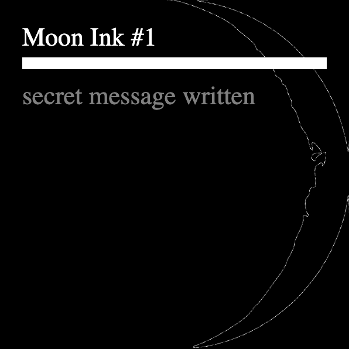

# 🌙 Moon Ink ✍️

_an experimental, on-chain NFT project, built on Ethereum_

## Who's it for

-   🪐 Stargazers and planetwatchers
-   ⛓ Blockchain enthusiasts
-   🌕 Full moon mystics
-   💾 Smart contract devs
-   ⚗️ Magick practitioners

## What's it for

Write secret messages in **🌙 Moon Ink ✍️**, which can only be read by the light of the Moon in the same phase as when written.

## How it works

1. Write a secret message
2. This mints an NFT on the Moon Ink contract (rendered 100% on-chain, with no off-chain files or metadata)
3. Your message can only be read during the same Moon phase as when you wrote it

### 🧐 An example

1. You write a secret message during the 🌒 Waxing Crescent phase
2. People can only read it when the Moon is in the Waxing Crescent phase (~7 out of 27 days)
3. Otherwise, the secret message will not reveal itself

### 🎡 Bonus mechanics

1. Want to read a message early? **Buy a vial of moon beams** for 0.01 ETH
2. Own a [Crypto Coven](https://www.cryptocoven.xyz/), [Watchfaces World](https://www.watchfaces.world/), or [Words](https://midwit.vercel.app/N4IgLgngDgpiBcIAmB7AxiANCNKB2YMBCA2qJLAiABYwCGSAlngOZYh1hgBOAzgqAA2MAG4xBCAIwBfbLgJEwpctDiJCADyXZNSxAHUU3JP2kBdWSsqIodbnRb2o1dvMLF4ZcKqq72fgyMTAAJGXmC6YN5GAFsoYWCAUQAlAGEAdgAmSWCwak4IwUEUAHdwiBQAV1yUYJjmMCieZhZwlAAzXJgtXPzGlhhG3jAjGCRg-ABaNHzmAEIQc0tvaxBbe0c6Z1d8dz0vCjVwbu1jrSoAVV4YXpuAI2K0AGtwu-FSmrqGibxb4LxBiUjE8Jp0KpVuMEZihGGgYIglpgrEc7pUioMADJhU5uRTKFZHQTYgCShBiOwUHgOPhsdgcThccl2eM8yN8J38HMQAFk6MwAUolhYkQSqEThqSYOSmZT9mzaRsGRS9vjDuzzjouSAAPJQMCxMLkoXLNWIcVgSXSnDMqnytZ0zbbGUq1mi9QczXnRAAQW4d0YPEqRosIZNNPtiq2jOtstV4b8nr0IG97UIkPBXwIwXBkOG3BaETw4yeeA+OZqTyIwWJABFMMFbMMbnlmyhK79a8E3sUSp9uEQkDBIS3ggBlABqAHEItxGkx+2gwIIIMF2twUDE-m57IuAHSLYV22gMFrsTg8fjwISicQITKyGMu6mrBNnJO8-mDA9h1bbuiLgAxSo8EXRh8DPLg+AEDgkCQfteEvEAAAYNDoAA2ABOAAOdJJAAZjoPC7jQPCsMw9IkNSJA0AwgBWb0siQgAhWj0logAWNBUiQ9oMMwvDJFcWY8GJJApDkSphg3b1-QQPA0UEbBulsIsxgQQMYGwdpgNA-AAGkYAgKh6gIVJ2IuEoAAleBrNCAEUUPQ7DcIIoiSLIjCKKomj6MYli2M47jeP4wTpB-I4-0AnT9XA7Bzygq8YLgmAEKoRzMJw-DCOI0jyMo6i6IYzJmNYjiuJ4viMIEoS+REsT4EkCSpJiGTGDkhSlI0FTB3qjStOisC8AMoz1DbIgLmSYkzJgEpJBYKAWCQFgnhYAApFh2lHb10ucrK3Nyzz8p8oqSoC8rgqq0LwqoY8mFYCCL2g4QxAkeB72dFlnyOV8Ah1PUDV4YNrsQSKwCAkCYrwB6EtABhktSxAdsy1yco8ryCt84r-LKoLKuquRhNEqQkKakYWtk+B5KKTrurU+A+pAbSIcG4bjIaMyLOs2yHNQjKXOy9y8u8wq-NKwKKpCxZgcfHcwYG2KOEgy9Ydg+DEKR-n9rRo6RaxsXzrxwSCdqomGpJnBJLJ1r2upkBlLoVTeu4SpNMZ+WhsM3wxrwCapvYma5oWpaVvWzbtt53aUcFw7hcx06cYly6pZFU0aHoO62DipWnpvV73sfT67R+rVfX9QMgZT8NQfB3Soazx7ErhtW0oj5GBYO9HjtFs7ccl43mFN9jsjQxqLea63KY6u2uodnr1Od12mdr1nEBMsAOasmz7I1vbUaFjGTux8WLuqsLK9-XZZZryHoeVpLm8R1vNb3mOD+7hOT6NnBCfqofJBH0m0kKZU0UtPWmTsXb9WZvpT2o12y+2mrNeai1lprQ2ltHeUcO46zjkfA2kswoWCAA) NFT? **Cast a connexion** to read any message, any time
3. Regret that late-night message you inscribed? **Burn your message**, but only if the Moon has not completed a full orbit since

### 🧪 Technologies used

-   Ethereum // Solidity
-   [solmate](https://github.com/Rari-Capital/solmate)
-   [hot-chain-svg](https://github.com/w1nt3r-eth/hot-chain-svg)
-   [foundry](https://github.com/foundry-rs/foundry)
-   [scaffold-eth](https://github.com/scaffold-eth/scaffold-eth) _🚧 UI coming soon 🚧_

## Credits

Built by [@neodaoist](https://twitter.com/neodaoist) // [neodaoist.xyz](https://neodaoist.xyz/) in Spring–Summer 2022
